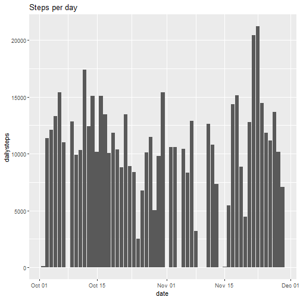
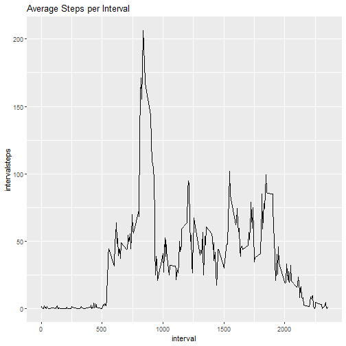
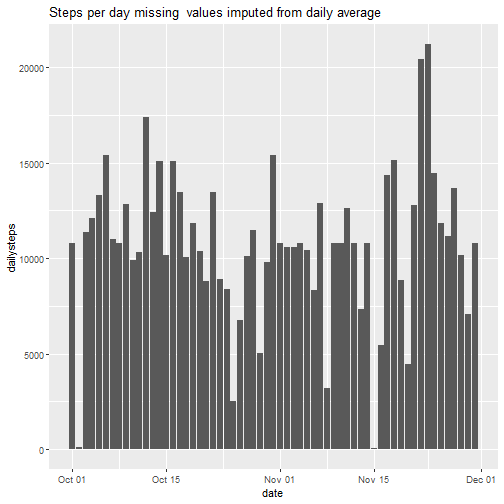
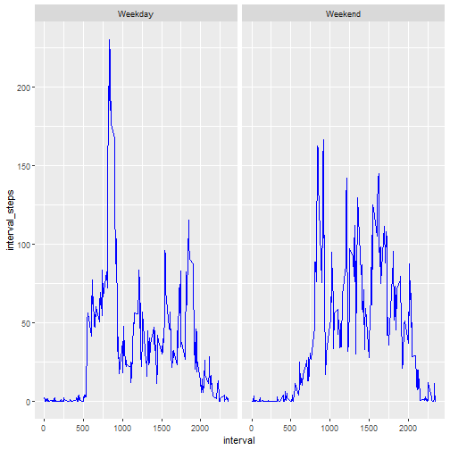

  
    

Movement Activity Monitoring
============================

## 1. Loading and preprocessing data ##
The script will run correctly if the file "activity.csv" has been downloaded and unzipped to the working directory.
Library the dplyr and ggplot packages.


```r
setwd("~/R5")
library(dplyr)
library(ggplot2)
activity <- read.csv("activity.csv", stringsAsFactors = FALSE)
activity$date <- as.Date(activity$date)
names(activity)
```

```
## [1] "steps"    "date"     "interval"
```

## 2. Calculate total number of steps per day and plot histogram##
Convert to a data table using dplyr, group the table by date, then create a new dataframe called **stps** containing the total number of steps per day, called **dailysteps**.


```r
act <- tbl_df(activity)
stps <- act %>% group_by(date) %>% summarise(dailysteps = sum(steps))
g1 <- ggplot(stps, aes(x = date, y = dailysteps)) + geom_bar(stat = "identity") + ggtitle("Steps per day")
print(g1)
```

```
## Warning: Removed 8 rows containing missing values (position_stack).
```



## 3. Mean and Median Steps per day

```r
meanstps <- as.integer(mean(stps$dailysteps, na.rm=TRUE))
medianstps <- as.integer(median(stps$dailysteps, na.rm=TRUE))
```

The Mean number of steps per day is **10766** and the median is **10765**. Reported in Integer, as decimals on such a large number is meaningless.

## 4. Average Daily Activity Pattern

Calculate the average steps per interval into a new dataframe called **stps2**, then plot the **steps (y)** against the **interval (x)**.


```r
stps2 <- act %>% group_by(interval) %>% summarise(intervalsteps = mean(steps, na.rm=TRUE))
g2 <- ggplot(stps2, aes(x = interval, y = intervalsteps)) + geom_line() + ggtitle("Average Steps per Interval")
print(g2)
```



##5. Interval with Maximum Steps

Determine the maximum of the averages, then identify the interval number with that value.


```r
max_interval <- max(stps2$intervalsteps)
stps3 <- stps2 %>% filter(intervalsteps == max_interval)
max_interval_no <- as.integer(stps3[1,2])
max_interval <- as.integer(stps3[1,1])
```
The Interval with the maximum average steps is number **206**, averaging **835** steps.

##6. Count the records with missing values

```r
is_complete <- complete.cases(act)
missing_val <- sum(!is_complete)
```
There are **2304** records with missing values.

##7. 8. and 9. Replace (impute) the missing values with Averages for that Interval

Find the records in the original dataframe **act** where steps = NA, then replace with it with the average for that interval from the stps2 data frame, saving in new imputed dataframe **act_imputed**

```r
interval_avg <- act %>%
  group_by(interval) %>%
  summarise(avg_steps = mean(steps, na.rm = TRUE))

act_imputed <- act

for (i in 1:nrow(act_imputed)) 
{
  if (is.na(act_imputed[i, "steps"]) == TRUE) 
  {
    intervalno <- as.integer(act_imputed[i, "interval"])
    imputed_value <- interval_avg[interval_avg$interval == intervalno, "avg_steps"]
    act_imputed[i, "steps"] <- imputed_value
  } 
  else 
  {
    act_imputed[i, "steps"] <- act[i, "steps"]
  }
}
```
## 9. Histogram of steps with NA repalce with daily average
Convert to a data table using dplyr, group the table by date, then create a new dataframe called **stps_imputed** containing the total number of steps per day, called **dailysteps**, and calculate the mean and median


```r
stps_imputed <- act_imputed %>% group_by(date) %>% summarise(dailysteps = sum(steps))
g3 <- ggplot(stps_imputed, aes(x = date, y = dailysteps)) + geom_bar(stat = "identity") + ggtitle("Steps per day missing  values imputed from daily average")
print(g3)
```



```r
meanstps_imputed<- as.integer(mean(stps_imputed$dailysteps, na.rm=TRUE))
medianstps_imputed <- as.integer(median(stps_imputed$dailysteps, na.rm=TRUE))
```
The Mean number of steps per day when imputing missing values is **10766** vs 10766 and the median is **10766** vs 10765.

##10. Compare the steps on weekdays versus weekends
First define if the date falls in a weekend or not, then double-plot with facets wrap on weekday indicator.

```r
act_imputed$date <- as.Date(act_imputed$date)
act_imputed$weekday_indicator <- ifelse(weekdays(act_imputed$date) %in% c("Saturday", "Sunday"), "Weekend", "Weekday")

stps4 <- act_imputed %>%  group_by(interval, weekday_indicator) %>% summarise(interval_steps = mean(steps, na.rm = TRUE))

ggplot(stps4, aes(x = interval, y = interval_steps)) +
  geom_line(color = "blue") +
  facet_wrap(~weekday_indicator)
```


